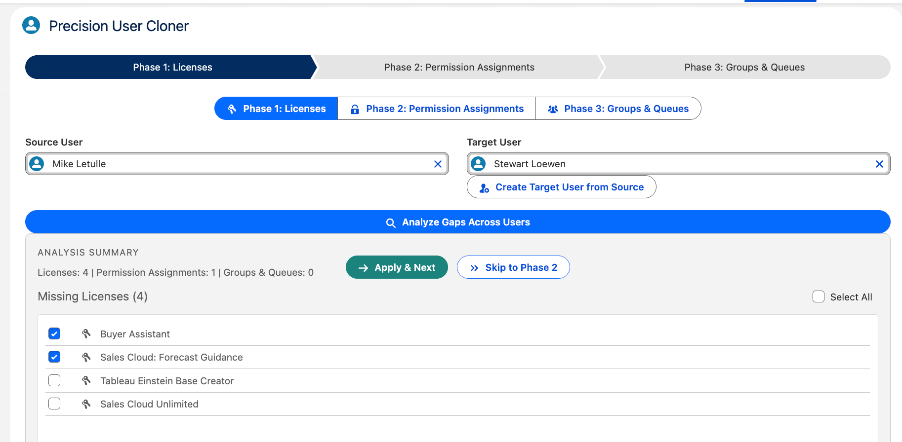

# User Cloner

User Cloner is a Salesforce Lightning Web Component (LWC) utility for comparing one user to another and selectively cloning user access and memberships.

It is designed to help admins quickly:

- copy missing **Permission Set Licenses** from a source user to a target user
- copy missing **Permission Set Groups** and **Permission Sets** from a source user to a target user
- copy missing **Public Group** and **Queue** memberships from a source user to a target user
- optionally **create a new target user from a source user template** before running the clone workflow

The component is intended to be placed on a Lightning page and exposed through a tab called **User Cloner**.

## What it does

The component guides the admin through 3 phases:

### Phase 1: Licenses
Compares the source and target users and shows any **missing Permission Set Licenses** assigned to the source but not the target.

These can be selected and applied directly.

### Phase 2: Permission Assignments
Compares the source and target users and shows missing:

- **Permission Set Groups**
- **individual Permission Sets**

The component avoids showing direct Permission Sets that are already covered by a Permission Set Group assigned to the target user.

Large Phase 2 copy jobs run asynchronously in the background to avoid synchronous Apex timeout issues.

### Phase 3: Groups & Queues
Compares the source and target users and shows missing:

- **Public Group memberships**
- **Queue memberships**

These can be selected and applied directly.

## Create Target User from Source

The component also includes a **Create Target User from Source** action.

This opens a modal that lets an admin create a new user using the selected source user as a template for defaults such as:

- Profile
- Role
- Time Zone
- Locale
- Language
- Email Encoding
- selected user permission flags

The following fields are intentionally left blank for manual entry:

- First Name
- Last Name
- Alias
- Nickname
- Email
- Username

After creation, the new user is automatically selected in the **Target User** picker.

## How to use

### 1. Add the component to a Lightning page
The component is exposed so it can be added to a Lightning page.

You mentioned you already created:

- a Lightning page
- a tab called **User Cloner**

Add the component to the page, save, and include the tab in the app where admins should use it.

### 2. Open the User Cloner tab
Navigate to the **User Cloner** tab.

### 3. Select a Source User
Choose the user whose access and memberships you want to copy from.

### 4. Select or create a Target User
Either:

- select an existing target user, or
- click **Create Target User from Source** to create a new target user first

### 5. Click Analyze Gaps Across Users
This compares the selected users and displays the missing items by phase.

### 6. Work through the phases

#### Phase 1
Select the missing licenses to copy and click **Apply & Next**.

#### Phase 2
Select the missing Permission Set Groups / Permission Sets and click **Apply & Next**.

Phase 2 runs as a background job for better scalability. The page displays job status while the copy is running.

#### Phase 3
Select the missing groups and queues and click **Finish: Clone Memberships**.

## Included UI features

- 3-phase guided workflow
- source and target user selection
- optional target user creation modal
- background job status panel for Phase 2
- select-all checkboxes per phase
- diagnostic failure report for synchronous phases
- analysis summary counts

## Technical notes

### Async behavior in Phase 2
Phase 2 uses an asynchronous Batch Apex job so large permission-assignment copy operations do not hit synchronous timeout limits.

### Sync behavior in Phases 1 and 3
Phases 1 and 3 remain synchronous so item-level errors can be surfaced immediately in the UI.

### License behavior
The user creation modal displays the source user license for reference, but in Salesforce the effective user license is determined by the selected **Profile**.

## Files involved

Typical files in this repo for the feature include:

- `UserCloneController.cls`
- `PermissionCloneBatch.cls`
- `userCloner.html`
- `userCloner.js`
- `userCloner.css`
- `userCloner.js-meta.xml`

## Permissions / access considerations

Admins using this utility should have access to:

- User records
- Permission Set Assignments
- Permission Set License Assignments
- Permission Set Groups
- Group / Queue membership records
- the Lightning page and tab where the component is exposed

They also need sufficient admin rights to create users and assign the selected access.

## Notes and limitations

- Phase 2 background jobs show job status, but detailed per-item async errors are not surfaced the same way as synchronous phase errors.
- Some user checkbox-style settings can vary by org and enabled features.
- Usernames must be globally unique across Salesforce orgs.

## Suggested use case

This utility is useful when:

- onboarding a new user similar to an existing user
- creating a replacement or backup user
- standardizing access across similar admin or business roles
- quickly comparing two users during troubleshooting

## Setup reminder

To expose the utility in the org:

1. Deploy the Apex classes and LWC.
2. Add the **User Cloner** component to a Lightning page.
3. Add the **User Cloner** tab to the desired Lightning app.
4. Grant the appropriate admin users access to the tab and page.

